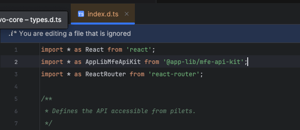

## How to startup

Нужно запустить все mfe, host-app, feed и bff

Перед запуском собрать библиотеки
```
lerna run build --scope="@app-lib/*" --scope="@evo.contracts/*" --scope="@app-system/config"
```

В 2х терминалах запустить
```sh
lerna run start --scope="@app/*"
lerna run start --scope="@mf/*"
```
Почему-то mfe не стартуют, если писать в одном терминале одной командой

- http://localhost:1234 - host-app
- http://localhost:2345 - mf-license
- http://localhost:3456 - mf-users

## Приложения
- `@app/feed` - на коленке собранный feed-service. Умеет проксировать запросы на dev-mfes с задержкой и без нее. `/feed` - прокси, `/direct-feed` - без прокси 
- `@app/bff` - симулятор активной деятельности бекендера. Сюда просто кидаются запросы
- `@app/host-app` - хостапа
---
- `@mfe/licence` - отвечает за что-то типо лицензии
- `@mfe/users` - отвечает за что-то типо юзеров

## Утилиты
- `@app-lib/react-core` - библиотека с примитивами для контрактов
- `@app-lib/ui-kit` - ну это типо ui-kit 

## Чепуха
- `@app-system/config` - оно пока не нужно, чет не заработал этот shared vite-config

## Api
### Request-api

В центре схемы лежит event-bus, который позволят асинхронно ждать инициализации клиента перед выполнением запроса. А также обрабатывать ошибку инициализации

Саму библиотеку контрактов не обязательно делать singleton. Она помещается в 0.5кб gzip и содержит по факту только декларации. И была намеренно спроектирована так, чтобы при ошибке в сборке и увеличении инстансов библиотеки приложение продолжало функционировать. Это было достигнуто благодаря событийной модели. При инициализации все инстансы контракта получат клиент и смогут с ним работать

## Нюансы piral-версий 1.8.5 vs 1.5.6
1. Пришлось переименовать `@app.lib/*` -> `@app-lib/*`, потому что иначе при генерации piral-типов он вставлял точку 🤡. Интересно, что с версией 1.8.5 он в целом все собирает в один файл и не переживает за такие моменты

